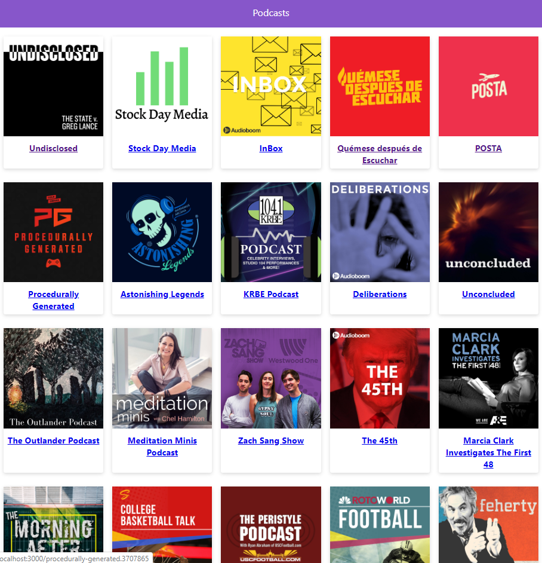

# Practica de Podcasts con nextjs

## Como funciona?

Requiere Node.js

* `npm install` para instalar dependencias
* `npm run dev` para el entorno de desarrollo
* `npm run build && npm start` para el entorno de produccion

## Licencia

MIT